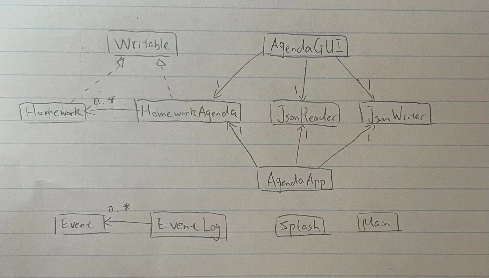

#Description of My Project
## A Homework Agenda
I will be creating a **homework agenda** for this project.

**Features of the homework agenda:**
- Students can include 
  the description of their homework and the subject of the homework in this homework agenda
- Once the students have completed the homework, the student will be able to remove the homework from the agenda.
- The student can enter a subject and then the agenda will be able to display what homework there is in the agenda 
  from that subject
- The student can delete all the homework with a specific subject
- The student can view all homework
- The student can see thte total number of homework
  
Students from elementary school and high school can use this agenda to keep track of their homework.

## Why does it interest me?
This project interest me because I have 
been using a homework agenda ever since I was grade 1 to be organized and to avoid forgetting due dates or homework. I 
used to use a paper agenda when I was young but once I got a phone, I downloaded an agenda app to keep track of my 
homework. I have tried many apps like that, but some of them are not convenient for users, so that is why I want to 
design a homework agenda that will be easy and convenient to use.

## User Stories
**User Stories:**
- As a user, I want to be able to add a homework to my agenda
- As a user, I want to be able to view the full list of homework on my agenda
- As a user, I want to be able to delete a homework from my agenda
- As a user, I want to be able to see the total number of homework from my agenda
- As a user, I want to be able to see the homework for a given subject
- As a user, I want to be able to delete all the homework with a given subject
- As a user, I want to be able to save my homework agenda to file
- As a user, I want to be able to be able to load my homework agenda from file 

## Phase 4, Task 2

Fri Nov 19 16:43:19 PST 2021
The homework: Math Assignment1 is added  
Fri Nov 19 16:43:24 PST 2021
The homework: CPSC Phase3 is added  
Fri Nov 19 16:43:36 PST 2021
The homework: CPSC  Lecture ticket is added  
Fri Nov 19 16:43:42 PST 2021
The homework: English Reading2 is added  
Fri Nov 19 16:43:59 PST 2021
The homework: Statistics Assignment3 is added  
Fri Nov 19 16:44:02 PST 2021
The homework: CPSC Phase3 is deleted  
Fri Nov 19 16:44:04 PST 2021
The homework: Statistics Assignment3 is deleted  
Fri Nov 19 16:44:13 PST 2021
The homework: CPSC Phase4 is added  
Fri Nov 19 16:44:20 PST 2021
The homework: CPSC  Lecture ticket is deleted 

## Phase 4, Task 3
Future Improvements:
1. instead of putting the save/load button in panel, I can make a menu bar called "file"
that allows users to save and load data, so the panel looks cleaner.
2. make helper methods in AgendaGUI for making buttons and adding button to panel to increase
readability.
UML:
